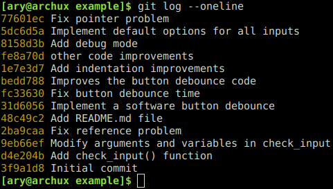
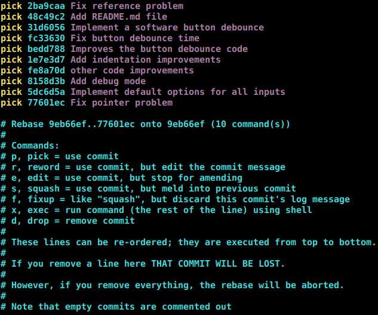
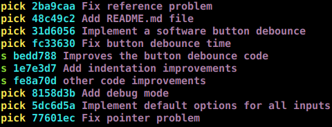
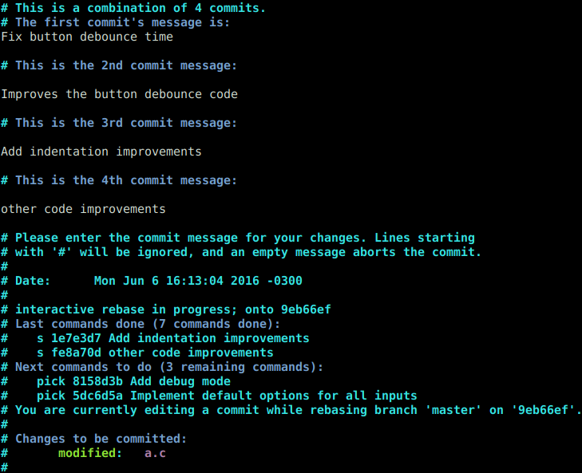
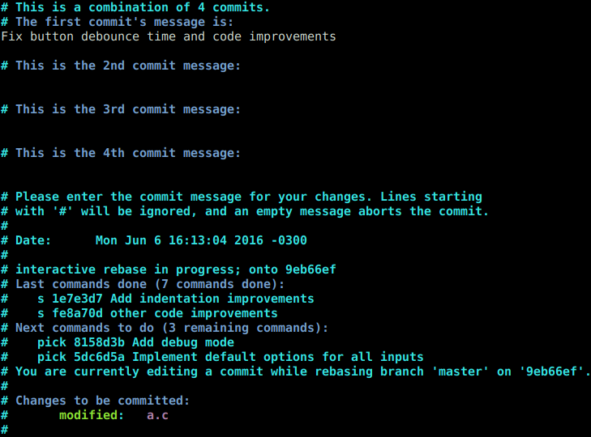

Squashing Commits with an Interactive Git Rebase
================================================

In this guide you are going to use interactive git rebase to squash multiples commits into a sigle commit.

Squashing commits are useful when you have a lot of commits with small changes and they are not meaningful or
they are part of a code modification. Maybe there is no good reason for these changes to be recorded in separates
commit because they all represent part of the same improvement. They would therefore be better represented if you
record them in a single commit.

If you squash commits, you should know that you will lose history. So be sure the history you are overwriting
is not meaningful to the story of your code.

For example, if one commit fixes an indentation of the line N and another commit fixes the indentation of the line
N+1, maybe these commits shouldn't be separated.

The command ``git rebase --interactive`` are going to edit the commit history, so you need to know how much of
history you want to edit. That is, how many commits from the HEAD you need to go back.

So you can see your commit history with:

``$ git log --oneline``

Now, sopousse you want to go around 10 commits back from the HEAD:

``$ git rebase --interactive HEAD~10``

That brings up a document in your terminal editor that you are you going to modify to control what the rebase does

The earliest commit we want to keep is **fc33630**. In this example you want to *squash* (*s*) a group of commits,
so you have to change **pick** by **s** like in the following image:

That *meld into previous commit* all commits marked with **s**. In this example it tells git to combine commits
fe8a70d and those before it into commit fc33630, the most previous commit that has not been squashed.

The next step is save changes and quit from the editor (in this case it is Vim) and now *git* will bring up another
document. In this case you can edit the commit message before squash.

The orignal document shows all commit that you are going to squash. You should remove comments from commits you are
going to squash and leave a single commit message representing all squashing commits. Something like this:

Save the document, quit and check your commit history:

``$ git log --oneline``

The final step is to push your change in the remote branch. Because you have rewrote the history, you must use a
force push:

``$ git push --force origin HEAD``

