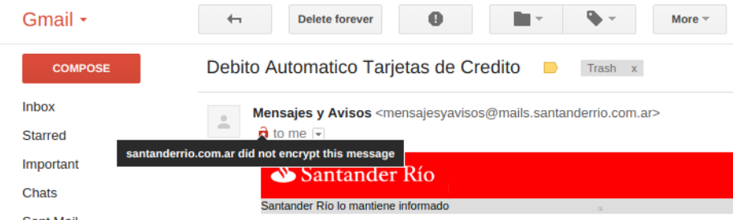

.. title: How to install and setup a powerful mail server on Linux
.. slug: how-to-install-and-setup-a-powerful-mail-server-on-linux
.. date: 2016-06-13 12:49:10 UTC-03:00
.. tags: 
.. category: 
.. link: 
.. description: 
.. type: text


Introduction
============

.. class:: alert alert-info pull-right

.. contents::

Setting up an email server is a difficult process involving a number of different programs,
each of which needs to be properly configured. The best approach is to install and configure
each individual component one by one, ensuring that each one works, and gradually build your
mail server.

This guide covers how to set up a mail server on Debian 8. Most of the steps also should
work on Ubuntu 14.04 LTS, considering that Ubuntu 14.04 LTS does not use systemd.

As I am Archlinux user, also I will clarify how to do some steps in Archlinux. But take care
that Archlinux is a rolling release, and maybe some precedures could change over time.

Mail Transfer Agent
-------------------

A Mail Transfer Agent (MTA) is the program which receives and sends out the email from your
server, and is therefore the key part. In this guide I use **Postfix**.

Mail filtering
--------------

You can add filtering in your mail chain, mainly in order to detect spam and viruses.
This howto only covers spam filter: **SpamassAssin**.

Mail Delivery Agent
-------------------

Is a computer software component that is responsible for the delivery of email messages to
a local recipient's mailbox. I use **Dovecot** LMTP.
Dovecot also implements an **IMAP** and **POP3** server.

Mail User Agent
---------------

Is the program used to access and manage emails. Example: Thunderbird
A web application that provides message management, composition, and reception functions is 
also considered an email client, but more commonly referred to as webmail. 
As a webmail I use Rainloop_, but there are other good choises

.. _Rainloop: http://www.rainloop.net

Database engine
---------------

We are going to use MySQL/MariaDB to store virtual users and virtual domains.
Postfix use the database to fetch info about users, domains, mailbox path, etc.
Postfix and Dovecot support both databases: MySQL/MariaDB and SQLite.
You should choose either of these according to your needs.

|

Installing Postfix with MySQL support
=====================================

First we need to install postfix (the MTA) and a database engine. In this case we are going
to use MariaDB

**Debian 8:**

.. code-block:: bash

    $ sudo apt-get install postfix postfix-mysql mariadb-server


**Archlinux:**

.. code-block:: bash

   $ sudo pacman -S postfix mariadb mariadb-clients


Postfix can run in a chroot environment (if you compile it from source it don't run in chroo
environment). Debian upstream decide to chroot Postfix by default. If this is your case, it will
run in `/var/spool/postfix` and it won't be able to communicate with the database because it
won't be able to see the socket file. To find out if it is running into a jail, you can run this:

.. code-block:: bash

    $ pid = `ps -ef | grep postfix | grep pickup | awk '{print $2}'`
    $ sudo ls -l /proc/$pid/root


It will give you something like this:

.. code-block:: bash

    $ sudo ls -l /proc/3233/root
    lrwxrwxrwx 1 root root 0 Jun  1 15:37 /proc/3233/root -> /var/spool/postfix

To solve this issue, you have to mount the database socket path inside the Postfix jail

.. code-block:: bash

   $ sudo mount -o bind /var/run/mysqld /var/spool/postfix/var/run/mysqld

To make it persistent after a reboot, you can't add a new entry in the `/etc/fstab` because the
`/var/run/mysqld` is created dynamically at boot time and you are going to have permission problems


The solution I found was to create a new systemd mount unit like this:

.. code-block:: bash

    $ cat /etc/systemd/system/var-spool-postfix-var-run-mysqld.mount

    [Unit]
    Description = Mount mysqld socket path inside the Postfix jail
    After = mysql.service

    [Mount]
    What = /var/run/mysqld
    Where = /var/spool/postfix/var/run/mysqld
    Type = none
    Options = bind

    [Install]
    WantedBy=multi-user.target


and enable this unit:

.. code-block:: bash

    $ sudo systemctl enable var-spool-postfix-var-run-mysqld.mount

Before enter in MySQL/MariaDB, we need to install an imap/pop3 server in order that a client can retrieve
the emails. We are going to use Dovecot. Just install it and then I’ll explain how to configure.
For now, only what we need is the *uid* and *gid* that Dovecot is going to use to set it on the Postfix
config files

.. code-block:: bash

    $ id dovecot

|

Installing Dovecot
==================

**Debian**:

.. code-block:: bash

    $ sudo apt-get install dovecot-mysql dovecot-lmtpd dovecot-pop3d dovecot-sieve dovecot-imapd dovecot-managesieved dovecot-sqlite

**Arch Linux**:

.. code-block:: bash

    $ sudo pacman -S dovecot


|

MySQL/MariaDB databases
=======================

Set the password for the root user and login to the database:

.. code-block:: bash

    $ mysql -uroot -ps3cr3t


Create a new database (mail) and user (mail):

::

    MariaDB [(none)]> create database mail;
    MariaDB [(none)]> grant all privileges on mail.* to mail@localhost identified by 'p4ssw0rd';


Now we need to create a set of tables that Postfix is going to query to complete parameters from the main.cf file.
You can create your own database scheme. This is mine:


.. code-block:: sql

    BEGIN;
    CREATE TABLE `domain` (
        `id` integer AUTO_INCREMENT NOT NULL PRIMARY KEY,
        `name` varchar(128) NOT NULL,
        `relay` boolean NOT NULL DEFAULT true,
        UNIQUE KEY `name` (`name`)
    );
    CREATE TABLE `transport` (
        `id` integer NOT NULL AUTO_INCREMENT PRIMARY KEY,
        `domain_id` integer NOT NULL,
        `type` varchar(128) NOT NULL default 'lmtp:unix:private/dovecot-lmtp',
        CONSTRAINT `fk_transport_domain` FOREIGN KEY (`domain_id`) REFERENCES `domain` (`id`),
        UNIQUE KEY `domain_id` (`domain_id`)
    );
    CREATE TABLE `virtual_user` (
        `id` integer AUTO_INCREMENT NOT NULL PRIMARY KEY,
        `domain_id` integer NOT NULL,
        `comment` varchar(255) NOT NULL,
        `address` varchar(255) NOT NULL,
        `pass` varchar(128) NOT NULL,
        `uid` smallint unsigned NOT NULL default 107,
        `gid` smallint unsigned NOT NULL default 114,
        `home` varchar(128) NOT NULL default '/var/vmail',
        `maildir` varchar(255) NOT NULL,
        `quota` bigint NOT NULL default '0',
        `active` boolean NOT NULL default true,
        `allow_imap` boolean NOT NULL default true,
        `allow_pop3` boolean NOT NULL default true,
        `last_login_ip` varchar(16),
        `last_login_date` DATETIME,
        `last_login_proto` varchar(5),
        CONSTRAINT `fk_virtual_user_domain` FOREIGN KEY (`domain_id`) REFERENCES `domain` (`id`),
        UNIQUE KEY `address` (`address`)
    );
    CREATE TABLE `virtual_alias_map` (
        `id` integer AUTO_INCREMENT NOT NULL PRIMARY KEY,
        `domain_id` integer NOT NULL,
        `recipient` varchar(255) NOT NULL,
        `destination` TEXT NOT NULL,
        CONSTRAINT `fk_virtual_alias_map_domain` FOREIGN KEY (`domain_id`) REFERENCES `domain` (`id`),
        UNIQUE KEY `recipient` (`recipient`)
    );
    COMMIT;

|


Remplace the *uid* and *gid* with the output of the: `$ id dovecot`

1. **domain** table:
   this table contains domains where the server will relay.

2. **transport table**:
   depending on the domain, it will determine which transport use: *local*, *virtual*, *dovecot lmtp*, etc.

   If an address or domain is NOT listed in transport_maps, it falls through to one of the other
   \*_transport settings: local_transport, virtual_transport, relay_transport or default_transport.
   Any mail, any address or domain listed in transport_maps, the result overrides whatever
   transport:nexthop which would have been used. If transport_maps is empty, domains listed in virtual_mailbox_domains
   will use virtual_transport, domains listed in mydestination are going to use local_transport, relay_domains
   use relay_transport, virtual_alias_domains have no transport, and anything else: default_transport.


3. **virtual\_user** table:
   This table contains the virtual users and information about user's mailboxes

4. **virtual\_alias_map** table:
   *alias* will alias specific mail addresses or domains to other local or remote address. field is used
   to get virtual_alias_maps parameter (default it is empty). This table rewrites recipient addresses
   for all local, all virtual, and all remote mail destinations. Virtual aliasing is applied only to recipient
   envelope addresses, and does not affect message headers. This is useful if you want two or more mail address
   go to one Inbox without affecting the mail header.


Create a file with this scheme and run:

.. code-block:: bash

    $ mysql -upostfix -pp4ssw0rd postfix < /tmp/create_tables.sql


Now we have to make some changes in the file `/etc/postfix/main.cf`. It should looks like this

::

    myhostname = mail.exmaple.com
    mydomain = example.com
    inet_interfaces = all
    mydestination = $myhostname, localhost.$mydomain, localhost
    virtual_mailbox_domains = mysql:/etc/postfix/cf.d/virtual_domains.cf
    virtual_mailbox_base = /var/vmail
    virtual_mailbox_maps = mysql:/etc/postfix/cf.d/mailbox_dir.cf
    virtual_minimum_uid = 76
    virtual_uid_maps = mysql:/etc/postfix/cf.d/uid.cf
    virtual_gid_maps = mysql:/etc/postfix/cf.d/gid.cf
    transport_maps = mysql:/etc/postfix/cf.d/transport.cf
    virtual_alias_maps = mysql:/etc/postfix/cf.d/virtual_alias.cf


**virtual_mailbox_domains**: contains a list of domains where Postfix is final destination. Mail is
delivered via the *$virtual_transport* mail delivery transport and by default it is the Postfix
virtual delivery agent. The SMTP server validates recipient addresses with *$virtual_mailbox_maps*
and rejects mail for non-existent recipients.

**virtual_mailbox_base**: it is a prefix that the virtual delivery agent prepends to all pathname
results from *$virtual\_mailbox\_maps* table lookups. It's a specific parameter of the virtual delivery agent.

**virtual_mailbox_maps**: The virtual delivery agent uses this table to look up the per-recipient
mailbox or maildir pathname. If the lookup result ends in a slash ("/"), maildir-style delivery is
carried out, otherwise the path is assumed to specify a UNIX-style mailbox file.

**virtual_minimum_uid**: The minimum user ID value that the virtual delivery agent accepts as a result from
*$virtual\_uid\_maps* table lookup. Take care because it's by default 100.

**virtual_uid_maps**: lookup tables with the user ID that the virtual delivery agent uses while writing
to the recipient's mailbox.

**virtual_gid_maps**: lookup tables with the user GID that the virtual delivery agent uses while writing to
the recipient's mailbox.

**transport_maps**: optional lookup tables with mappings from recipient address to message delivery transport
or next-hop destination.

**virtual_alias_maps**: optional lookup tables that alias specific mail addresses or domains to other local or remote address.

For more detailed info use `$ man 5 postconf`


Query files
-----------

We have to create the querys files in `/etc/postfix/cf.d` directory:

*/etc/postfix/cf.d/gid.cf*

::

    user = mail
    password = P4ssw0rd
    dbname = mail
    hosts = unix:/var/run/mysqld/mysqld.sock
    query = SELECT gid FROM virtual_user WHERE address = '%s'


*/etc/postfix/cf.d/mailbox_dir.cf*

::

    user = mail
    password = P4ssw0rd
    dbname = mail
    hosts = unix:/var/run/mysqld/mysqld.sock
    query = SELECT maildir FROM virtual_user WHERE address = '%s'

*/etc/postfix/cf.d/transport.cf*

::

    user = mail
    password = P4ssw0rd
    dbname = mail
    hosts = unix:/var/run/mysqld/mysqld.sock
    query = SELECT type FROM transport INNER JOIN domain ON (domain.id=domain_id) WHERE name='%s'


*/etc/postfix/cf.d/uid.cf*

::

    user = mail
    password = P4ssw0rd
    dbname = mail
    hosts = unix:/var/run/mysqld/mysqld.sock
    query = SELECT uid FROM virtual_user WHERE address = '%s'


*/etc/postfix/cf.d/virtual_alias.cf*

::

    user = mail
    password = P4ssw0rd
    dbname = mail
    hosts = unix:/var/run/mysqld/mysqld.sock
    query = SELECT destination FROM virtual_alias_map WHERE recipient = '%s'


*/etc/postfix/cf.d/virtual_domains.cf*

::

   user = mail
   password = P4ssw0rd
   dbname = mail
   hosts = unix:/var/run/mysqld/mysqld.sock
   query = SELECT name FROM domain WHERE name = '%s' AND relay = true


Restart the Postfix service

|

Postfix - SMTPS with SSL/TLS
============================

**Create a mini certificate authority (CA):**

Generate the CA private key:

.. code-block:: bash

   $ openssl genpkey -algorithm RSA -pkeyopt rsa_keygen_bits:2048 -out ca.key


Generate self-sign CA certificate:

.. code-block:: bash

    $ openssl req -new -x509 -key ca.key -out ca.crt -days 1095


To see the certificate:

.. code-block:: bash

    $ openssl x509 -in ca.crt -noout -text


**Create the Postfix key and certificate**

Generate the mail server private key:

.. code-block:: bash

    $ openssl genpkey -algorithm RSA -pkeyopt rsa_keygen_bits:2048 -out server.key


Create the certificate request. This time, the CN must be the FQDN of the mail server:

.. code-block:: bash


    $ openssl req -new -key server.key -out server.csr


Sign the certificate request with the CA private key and certificate.

.. code-block:: bash

    $ openssl x509 -req -days 1094 -in server.csr -CA ca.crt -CAkey ca.key -set_serial 01 -out server.crt


**Installing TLS in Postfix**

Move the the following files into */etc/postfix/certs*: ca.crt, server.crt, server.key

Add the following parameters to the `main.cf`:

::

    smtpd_tls_security_level = may
    smtpd_tls_loglevel = 1
    smtp_tls_note_starttls_offer = yes
    smtpd_tls_cert_file = /etc/postfix/certs/server.crt
    smtpd_tls_key_file = /etc/postfix/certs/server.key
    smtpd_tls_CAfile = /etc/postfix/certs/ca.crt
    smtpd_tls_session_cache_database = btree:${data_directory}/smtpd_scache
    smtp_tls_session_cache_database = btree:${data_directory}/smtp_scache


The conventional way for a mail client program to send e-mail is using TCP port 25, which is also
the port used by mail servers to talk to each other. But port 25 is widely abused by malware
to spread worms and spam. As a result, many ISPs are restricting its use. If you run your own
mailserver in a datacenter, you might have to enable the submission port (587) in Postfix to be
able to send emails from your local email client to your own mailserver.

Edit **master.cf** and uncomment the line:

::

    submission inet n    -    n    -    -    smtpd

Restart the Postfix service and check if TLS is working with the *starttls* command:

::

    $ telnet mailserver.example.org 25
    Escape character is '^]'.
    220 mx.kleinerman.org ESMTP Postfix
    starttls
    220 2.0.0 Ready to start TLS

Or you can use openssl:

.. code-block:: bash

   $ openssl s_client -starttls smtp -connect mailserver.example.org:25 -crlf

|

IMAP and POP3 with DOVECOT (with SSL/TLS support)
=================================================

Dovecot is an open source IMAP and POP3 server for Linux/UNIX-like system.
Dovecot also includes a Mail delivery agent (called Local delivery agent in Dovecot's documentation),
with optional Sieve filtering support.

**Configuration**

Files:

* /etc/dovecot/dovecot.conf: Dovecot's main configuration file
* /etc/dovecot/dovecot-sql.conf.ext: Dovecot's SQL authdb/userdb module configuration file.
* etc/dovecot/dovecot-ldap.conf.ext: Dovecot's LDAP authdb/userdb module configuration file.
* /etc/dovecot/dovecot-dict-sql.conf.ext: Dovecot's dict configuration with SQL-backend.
* /etc/dovecot/conf.d/auth-\*-conf.ext: Configuration files of different authentication modules.
* /etc/dovecot/conf.d/\*.conf: Configuration files of different services and settings.


Debian/Ubuntu comes with examples in conf.d directory. In Arch Linux, you have the examples in
*/usr/share/doc/dovecot/example-config/\*. So you can start copying the *conf.d* direcotry from this location.

Edit **/etc/dovecot/dovecot.conf** and add the protocols you want to use:

::

    protocols = imap pop3


Later in this howto we are going to use sieve and lmtp, so consider include this protocols:

::

    protocols = imap pop3 sieve lmtp


In Debian 8, there is one file per protocol in **/usr/share/dovecot/protocols.d/** and dovecot.conf has an "include"
to this location.


::

   !include_try /usr/share/dovecot/protocols.d/*.protocol


We start with 10-auth.conf file. We are going to get the user's data from MySQL.
Uncomment the line with **!include auth-sql.conf.ext**
So **/etc/dovecot/conf.d/10-auth.conf** should looks like this:

::

    auth_mechanisms = plain login
    !include auth-sql.conf.ext


The simplest authentication mechanism is PLAIN. The client simply sends the password unencrypted to Dovecot.
All clients support the PLAIN mechanism, but obviously there's the problem that anyone listening on the network
can steal the password. For that reason (and some others) other mechanisms were implemented.

Today however many people use SSL/TLS, and there's not problem with sending unencrypted password inside SSL
secured connections. So if you're using SSL, you probably don't need to bother worrying about anything else than
the PLAIN mechanism.

Another plaintext mechanism is LOGIN. It's typically used only by SMTP servers to let Outlook clients perform
SMTP authentication. Note that LOGIN mechanism is not the same as IMAP's LOGIN command.
The LOGIN command is internally handled using PLAIN mechanism.

**disable_plaintext_auth=yes** allows plaintext authentication only when *SSL/TLS* is used first.

If you want to enable POP3/IMAP services without STARTTLS for some reason (not recommended), set "disable_plaintext_auth = no":

::

    disable_plaintext_auth = no

I'm not an Outlook user, but I have to set that value to work properly with Outlook.


Hashed passwords
----------------

We are going to store hashed passwords in the SQL databases, because someone could gain access to the database and
steal passwords. So we need to configure Dovecot to get user/password from the database. If you use MariaDB/MySQL,
the */etc/dovecot/conf.d/auth-sql.conf.ext* file should looks like this:

::

    passdb {
    driver = sql
    args = /etc/dovecot/dovecot-sql.conf.ext
    }

    userdb {
    driver = sql
    args = /etc/dovecot/dovecot-sql.conf.ext
    }


Dovecot authenticates users against password databases. You can use multiple databases, so if the password doesn't
match in the first database, Dovecot checks the next one. These databases simply verify if the given password is
correct for the user. Dovecot doesn't get the correct password from the database, it only gets a "success" or a "failure"
reply.

After a user has been successfully authenticated, Dovecot looks up the user's userdb information. The userdb lookup
finds out how to deliver mails for the user. The user database lookup returns these fields:

* **uid**: User's UID (UNIX user ID), overrides the global mail_uid setting.
* **gid**: User's GID (UNIX group ID), overrides the global mail_gid setting.
* **home**: User's home directory, overrides the global mail_home setting. Although not required, it's highly recommended even for virtual users.
* **mail**: Mail location, overrides the global mail_location setting.

Now we have to edit */etc/dovecot/dovecot-sql.conf.ext*:

::

    driver = mysql
    connect = host=/var/run/mysqld/mysqld.sock dbname=mail user=mail password=MyPassword
    default_pass_scheme = MD5
    password_query = \
        SELECT address AS user, pass AS password FROM virtual_user \
        WHERE address = '%u' AND active = true AND ( \
        ('%s' = 'imap' AND allow_imap = true) OR \
        ('%s' = 'pop3' AND allow_pop3 = true) OR \
        ('%s' = 'smtp') OR '%s' = 'sieve' OR '%s' = 'lmtp' )
    user_query = \
        SELECT CONCAT(home,'/',maildir) AS home, uid, gid \
        FROM virtual_user WHERE address = '%u' AND active = true

.. note:: In this example I've used MD5, but you can use other password chemes (http://wiki.dovecot.org/Authentication/PasswordSchemes)


Where:

* **%u** = full username (user@domain)
* **%n** = user part of user@domain
* **%d** = domain part of user@domain
* **%s** variable expands to imap or pop3 in password_query (http://wiki2.dovecot.org/Authentication/RestrictAccess)

.. note:: More info about Dovecot variables here: http://wiki.dovecot.org/Variables


Now we have to edit **/etc/dovecot/conf.d/10-mail.conf**. It should looks like this:

::

	mail_location = maildir:/var/vmail/%d/%n
	mail_privileged_group = dovecot
	namespace inbox {
		inbox = yes
	}
	first_valid_uid = 107
	last_valid_uid = 107
	first_valid_gid = 114
	last_valid_gid = 114


You can get the dovecot uid and gid with:

.. code-block:: bash

	$ id dovecot


SSL/TLS
-------

Edit */etc/dovecot/conf.d/10-ssl.conf*:

::

	ssl = yes
	ssl_cert = </etc/postfix/tls/server.crt
	ssl_key = </etc/postfix/tls/server.key
	ssl_ca = </etc/postfix/tls/ca.crt


and restart dovecot service:

.. code-block:: bash

	$ sudo systemctl restart dovecot.service


|

Outgoing mail authentication via SASL
=====================================

SMTP servers need to decide whether an SMTP client is authorized to send mail to remote
destinations, or only to destinations that the server itself is responsible for. By default,
Postfix will forward mail from clients in authorized network blocks to any destination.
Authorized networks are defined in ```$mynetworks``` Postfix can forward emails from  authenticated
clients via SASL. This allows clients, outside ```$mynetworks```, to send mails.

First we need to identify which SASL plugin does our Postfix support:

::

	$ sudo postconf -a
	cyrus
	dovecot


Configuring Dovecot SASL plugin
-------------------------------

Communication between the Postfix SMTP server and Dovecot SASL happens over a UNIX-domain socket or
over a TCP socket. We will be using a UNIX-domain socket for better privacy.


**Dovecot config**:

In `/etc/dovecot/conf.d/10-master.conf`, the section service auth should look like this:


::

	service auth {
	#Postfix smtp-auth
	unix_listener /var/spool/postfix/private/auth {
		user = postfix
		group= postfix
		mode = 0660
		}
	}


It is going to set up a Unix socket with owner postfix, group postfix and permission 0660. Postfix
will communicate with Dovecot through this socket.

In  ``/etc/dovecot/conf.d/10-auth.conf`` add:

::

	auth_mechanisms = plain login


**Postfix config**:

add the following lines in the Postfix main.cf:

::

	broken_sasl_auth_clients = yes
	smtpd_sasl_type = dovecot
	smtpd_sasl_path = private/auth
	smtpd_sasl_auth_enable = yes
	smtpd_sasl_local_domain = $myhostname
	smtpd_sasl_security_options = noanonymous
	smtpd_relay_restrictions = permit_mynetworks,
	    permit_sasl_authenticated,
	    reject_unauth_destination
	smtpd_recipient_restrictions = permit_mynetworks,
	    permit_sasl_authenticated


Restart Dovecot and Postfix service

|

SPAM Filter
===========

SpamAssassin
------------

**SpamAssassin** is a mature, widely-deployed open source project that serves as a mail filter to
identify Spam. SpamAssassin uses a variety of mechanisms including header and text analysis, Bayesian
filtering, DNS blocklists, and collaborative filtering databases.

Installation
~~~~~~~~~~~~

**Debian/Ubuntu**


.. code-block:: bash

    $ sudo apt-get install spamassassin spamc


Now we have to make some change in ``/etc/default/spamassassin`` (only for Ubuntu):
To enable Spamassassin find the line *ENABLED=0* and change it to *ENABLED=1*

.. note:: If you're using systemd (default for jessie), the ENABLED setting is not used. Instead, enable spamd by issuing:

.. code-block:: bash

    $ sudo systemctl enable spamassassin.service


To enable automatic rule updates, in order to get the latest spam filtering rules, find the line **CRON=0**
and change by **CRON=1**

.. code-block:: bash

    $ sudo sa-update
    $ sudo service spamassassin start


**ArchLinux**

.. code-block:: bash

    $ sudo pacman -S spamassassin

In Arch Linux, Spamassassin doesn't need the before changes. The installation will create automatically the user
and group **spamd** and the work directory. To enable at boot time you need to enable by systemd:

.. code-block:: bash

    $ sudo sa-update
    $ sudo systemctl start spamassassin
    $ sudo systemctl enable spamassassin


Configuration files in Arch for spamassassin are in ``/etc/mail/spamassassin`` whereas in Debian/Ubuntu they
are in ``/etc/spamassassin``

The ``sa-update`` command is used to update the Spamassassin ruleset. ``sa-update`` will not restart **spamd**
or otherwise cause a scanner to reload the now-updated ruleset automatically. Instead, ``sa-update`` is typically
used in something like the following manner:

.. code-block:: bash

    $ sudo sa-update && sudo systemctl reload spamassassin


Configure Postfix to use SpamAssassin
~~~~~~~~~~~~~~~~~~~~~~~~~~~~~~~~~~~~~

To integrate SpamAssassin into Postfix, you'll need to pipe incoming mails through a script or program that passes
the mail to SpamAssassin for rewriting, and then either chooses to send it on or discard it
(you may wish to discard it, for example, if SpamAssassin reports a very high spam score)

Postfix receives unfiltered mail from the network with the smtpd server, and delivers unfiltered mail to a content
filter with the Postfix pipe delivery agent. The content filter injects filtered mail back into Postfix with the Postfix
sendmail command, so that Postfix can deliver it to the final destination.


Edit ``/etc/postfix/master.cf`` and find the line:

::

    smtp         inet          n        -       n        -          -       smtpd

and add the following:

::

    -o content_filter=spamassassin


It shoud look like this:

::

    smtp        inet        n       -       n       -       -        smtpd
        -o content_filter=spamassassin


 Then add the following line to the end of the file:

::

    spamassassin    unix    -       n       n       -       -       pipe
        user=debian-spamd argv=/usr/bin/spamc -s 10485760 -e /usr/sbin/sendmail -oi -f ${sender} ${recipient}


.. note:: in Arch Linux, *spamc* is located in ``/usr/bin/vendor_perl/`` and sendmail in ``/usr/bin/sendmail``
   and the user is *spamd*


Greylisting with Postgrey
-------------------------

Greylisting is another method of defending e-mail users against spam. A mail transfer agent (MTA) using greylisting
will "temporarily reject" any email from a sender it does not recognize. If the mail is legitimate the originating
server will try again after a delay, and if sufficient time has elapsed the email will be accepted. In my experience
it is a great anti-spam methods and works very well.

Greylisting is effective because many mass email tools used by spammers do not queue and reattempt mail delivery as
is normal for a regular Mail Transport Agent. They do not queue and resend email as this requires the expenditure
of resources (spamming normally operates on very narrow margins).

A server employing greylisting deliberately degrades mail service for unknown or suspect sources, over a short period
of time. Typically, it records three pieces of data, known as a **"triplet"**, for each incoming mail message:

* The IP address of the connecting hos
* The envelope sender address
* The envelope recipient address(es), or just the first of them.

This data is registered on the mail server's internal database, along with the time-stamp of its first appearance.
The email message will be dismissed with a temporary error until the configured period of time is elapsed, usually
some minutes or a small number of hours. I used to use 60s. Temporary errors are defined in the Simple Mail Transfer
Protocol (SMTP) as 4xx reply codes: Fully capable SMTP implementations are expected to maintain queues for retrying
message transmissions in such cases.


Installation
~~~~~~~~~~~~

There are a lot of Greylisting implementation. I will use **Postgrey**. It works fine with Postfix.

**Debian/Ubuntu**

.. code-block:: bash

    $ sudo apt-get install postgrey

The default delay is 300 seconds (5 minutes), to change this value edit ``/etc/default/postgrey``. It is recommended
not to exceed 300 seconds. This is why I've changed it to 60 seconds.

If it is going to run in the same machine that postfix is running, I prefer to use Unix sockets.

Add --delay=N to the POSTGREY_OPTS:

::

    POSTGREY_OPTS="--unix=/var/spool/postfix/postgrey/postgrey.socket --delay=60"
    POSTGREY_TEXT="This mail has been temporarily rejected (graylisted). Try again in %s seconds"


**Archlinux**:

.. code-block:: bash

    $ sudo pacman -S postgrey

Archlinux uses systemd so modify the line **ExecStart** in the postgrey unit service.
I use this configuration:

::

    ExecStart=/usr/bin/postgrey \
    --unix=/var/spool/postfix/postgrey/postgrey.socket \
    --delay=60 \
    --pidfile=/run/postgrey/postgrey.pid \
    --group=postgrey \
    --user=postgrey \
    --daemonize \
    "--greylist-text=Greylisted for %%s seconds"


Configure Postfix to use Postgrey
~~~~~~~~~~~~~~~~~~~~~~~~~~~~~~~~~

Edit **main.cf** and add this option in *smtpd_recipient_restrictions*:

::

    smtpd_relay_restrictions =
        permit_mynetworks,
        permit_sasl_authenticated,
        reject_unauth_destination
    smtpd_recipient_restrictions =
        permit_mynetworks,
        permit_sasl_authenticated,
        check_policy_service unix:postgrey/postgrey.socket


|

Webmail
=======

For running a webmail client, you need to install a web server, PHP and a database. I'm going to use Nginx,
but you can use Apache.

Installing Nginx with PHP (Debian/Ubuntu)
-----------------------------------------

.. code-block:: bash

    $ sudo apt-get install nginx


By default it comes well configured, ready for use. You only need to add a site configuration
file in ``/etc/nginx/sites-available`` and create a link to that file in ``/etc/nginx/sites-enable``

**Installing PHP**

.. code-block:: bash

    $ sudo apt-get install php5-fpm


The default nginx configuration that comes with Ubuntu already contains the configuration for php-fpm.
Inside each server block serving a PHP web application should appear a location block similar to:


::


    location ~ \.php$ {
        root /var/www/rainloop;
        fastcgi_pass   unix:/run/php5-fpm.sock;
        fastcgi_index  index.php;
        include        fastcgi.conf;
    }
            

and add **index.php** to the index parameter in the server block:

::

    server {
        ...
        index index.html index.htm index.php;
        ...
    }


Edit the file ``/etc/php5/fpm/pool.d/www.conf`` and make this change to use unix socket file:

::

    ;listen = 127.0.0.1:9000
    listen = /var/run/php5-fpm.sock
    listen.owner = www-data
    listen.group = www-data
    listen.mode = 0660

Now restart Nginx and php5-fpm

.. code-block:: bash

    $ sudo service nginx restart; sudo service php5-fpm restar


Installing Nginx with PHP (ArchLinux)
-------------------------------------

.. code-block:: bash

    $ sudo pacman -S nginx php-fpm

I prefer arrange the Nginx configuration like Debian/Ubuntu, so I create this two directories:

* /etc/nginx/sites-available: a one config file for each site
* /etc/nginx/sites-enable: symbolic links to enable config files

In the ``/etc/nginx/nginx.conf`` (at the end of the http block) add an include like this:

::

    include       /etc/nginx/sites-enabled/*;


It includes all symbolic link website files

Edit the file ``/etc/php/php-fpm.conf`` and make this change to use unix socket file:

::

    ;listen = 127.0.0.1:9000
    listen = /run/php-fpm/php-fpm.sock


Inside each server block serving a PHP web application should appear a location block similar to:

::

    location ~ \.php$ {
        root /srv/http/webmail1;
        fastcgi_pass   unix:/run/php-fpm/php-fpm.sock;
        fastcgi_index  index.php;
        include        fastcgi.conf;
    }

and add index.php to the index parameter in the server block:

::

    server {
        ...
        index index.html index.htm index.php;
        ...
    }

Restart Nginx and php-fpm:

.. code-block:: bash

    $ sudo systemctl restart nginx && sudo systemctl restart php-fpm


Installing Rainloop webmail
---------------------------

Rainloop is a web-based email client. There are others web-based client but this is simple, modern and has
a nice look.

.. code-block:: bash

    # RAINLOOP_DIR=/var/www/rainloop (in Ubuntu)
    # RAINLOOP_DIR=/srv/http/rainloop (in Archlinux)
    # mkdir $RAINLOOP_DIR
    # cd $RAINLOOP_DIR
    # wget http://repository.rainloop.net/v2/webmail/rainloop-community-latest.zip
    # unzip rainloop-latest.zip


Change the owner:

.. code-block:: bash

    $ sudo chown -R www-data:www-data $RAINLOOP_DIR
    $ sudo chown -R http:http $RAINLOOP_DIR

Edit *php.ini* file and enable incov.so extension:

::

    extension=iconv.so

Restart the *php5-fpm* service

In nginx create a new server block for **rainloop**. It should look like this for Debian/Ubuntu:


::

	server {
		listen       80;
		server_name  webmail.example.org;
		location / {
			root /srv/http/rainloop;
			index  index.html index.htm index.php;
		}
		location ~ \.php$ {
			root /var/www/rainloop;
			fastcgi_pass   /var/run/php5-fpm.sock;
			fastcgi_index  index.php;
			include        fastcgi_params;
		}
		error_page   500 502 503 504  /50x.html;
		location = /50x.html {
			root   /usr/share/nginx/www;
		}
	}


And for Arch Linux it should look like this:

::

	server {
	    listen       80;
	    server_name  webmail.example.org;
	    location / {
	        root /srv/http/rainloop;
		    index  index.html index.htm index.php;
	    }
	    location ~ \.php$ {
	        root /srv/http/webmail2;
	        fastcgi_pass   unix:/run/php-fpm/php-fpm.sock;
	        fastcgi_index  index.php;
	        include        fastcgi.conf;
	        include fastcgi_params;
	    }
	    error_page   500 502 503 504  /50x.html;
	    location = /50x.html {
	        root   /usr/share/nginx/html;
	    }
	}

Restart Nginx, open a browser with the address:
*webmail.example.org/?admin* to configure the environment and follow the configuration steps

|

Mail Filter with Sieve
======================

Sieve is a programming language that can be used to create filters for email. Dovecot has a plugin
(Pigeonhole) that implements Sieve. To use Sieve, you will first need to make sure you are using
Dovecot LDA or LMTP for delivering incoming mail to users' mailboxes. Then, you need to enable the
Pigeonhole Sieve plugin in your Dovecot configuration files.

Postfix and Dovecot LMTP
------------------------

The first step is to enable its stack via ``/etc/dovecot/dovecot.conf``

(in Debian/Ubuntu it is included via ``/usr/share/dovecot/protocols.d/lmtpd.protocol``)

::

	!include conf.d/*.conf
	protocols = imap pop lmtp


Socket configuration
~~~~~~~~~~~~~~~~~~~~

The socket is configured in */etc/dovecot/conf.d/10-master.conf*.
The LMTP service can be bound to both INET or Unix sockets. In my case I decided to use a Unix socket file.
It is placed inside the Postfix spool with appropriate permissions set:

::

	service lmtp {
		unix_listener /var/spool/postfix/private/dovecot-lmtp {
	   		group = postfix
	   		mode = 0600
	   		user = postfix
	  	}
	}


Plugin Support
~~~~~~~~~~~~~~

Sieve plugin support can be enabled at protocol level via */etc/dovecot/conf.d/20-lmtp.conf*:

::

	protocol lmtp {
		postmaster_address = postmaster@example.org
		mail_plugins = $mail_plugins sieve
	}


Postfix main.cf configuration
~~~~~~~~~~~~~~~~~~~~~~~~~~~~~

The final step is to tell Postfix to use this socket for final delivery. In a virtual user scenario you can use
*virtual_transport* parameter:

::

	virtual_transport = lmtp:unix:private/dovecot-lmtp

For a non virtual user setup (as when mail_location = maildir:~/.maildir ):

::

	mailbox_transport = lmtp:unix:private/dovecot-lmtp

But in this guide, the transport_map look up in a transport table. So you only need to modify
the table to modify the transport. For example the SQL sentence should be like this:


.. code-block:: sql

	UPDATE transport SET transport = 'lmtp:unix:private/dovecot-lmtp' WHERE domain = 'example.org';


Now message will be delivery by Dovecot LMTP instead of Postfix virtual delivery agent.
You can check logs if it is working. For example the Postfix logs should show something like this:

::

	relay=example.org[private/dovecot-lmtp]

Or you can enable Dovecot debug option in */etc/dovecot/conf.d/10-logging.conf*

::

	mail_debug = yes


and check the Dovecot logs.


Pigeonhole Installation
-----------------------

Pigeonhole is the sieve implementation for Dovecot

**Debian/Ubuntu:**

::

	$ sudo apt-get install dovecot-sieve dovecot-managesieved


**Archlinux:**

::

	$ sudo pacman -S pigeonhole


In ``/etc/dovecot/conf.d/20-lmtp.conf``, add the sieve plugin:

::

	protocol lmtp {
		postmaster_address = postmaster@example.org
		mail_plugins = $mail_plugins sieve
	}


.. code-block:: bash

	$ sudo cp /usr/share/doc/dovecot/example-config/conf.d/90-sieve.conf /etc/dovecot/conf.d/90-sieve.conf


Edit ``/etc/dovecot/conf.d/90-sieve.conf``:

::

	plugin {
	    ...
	    sieve = ~/.dovecot.sieve
	    sieve_default = /var/lib/dovecot/sieve/default.sieve
	    sieve_dir = ~/sieve
	    sieve_before = /var/lib/dovecot/sieve/before/
	    ...
	}


* *sieve = ~/.dovecot.sieve*: The path to the user's main active script.
   If ManageSieve is used, this the location of the symbolic link controlled by ManageSieve.

* *sieve_default = /var/lib/dovecot/sieve/default.sieve*: The default Sieve script when the user has none.
   This is a path to a global sieve script file, which gets executed ONLY if user's private Sieve script
   doesn't exist. Be sure to pre-compile this script manually using the sievec command line tool.

* *sieve_dir = ~/sieve*: Directory for :personal include scripts for the include extension.
   This is also where the ManageSieve service stores the user's scripts.

* *sieve_before = /var/lib/dovecot/sieve/before/*: Path to a script file or a directory containing script
   files that need to be executed before the user's script. If the path points to a directory, all the Sieve
   scripts contained therein (with the proper .sieve extension) are executed. The order of execution within a
   directory is determined by the file names, using a normal 8bit per-character comparison. Multiple script
   file or directory paths can be specified by appending an increasing number.


Moving spam to Spam folder
--------------------------

So we are going to put in **sieve_before** a Sieve script for filter spam. When the message is spam, it
moves the message to the spam folder and stop. Why stop? Because maybe there are users with personal Sieve
scripts for vacation/out-of-office auto-reply and we don't wanna auto-reply spam message. Later I will explain
how the user can generate their own Sieve scripts (using managesieve protocol)

First, create the following directory:

.. code-block:: bash

	$ sudo mkdir -p /var/lib/dovecot/sieve/before


The following rule moves incoming emails to Spam folder automatically. **X-Spam-Flag** is added by spamassassin:


.. code-block:: bash

	$ sudo vi /var/lib/dovecot/sieve/before/spam.sieve


::

	require ["fileinto"];
	if header :contains "X-Spam-Flag" "YES" {
		fileinto "Spam";
		stop;
	}


And compile it with:

.. code-block:: bash

	$ sudo sievec /var/lib/dovecot/sieve/before/spam.sieve


All Sieve script must finish with *.sieve* extension.


.. note:: By default Spamassassin modifies the subject (with \*\*\*\*\*SPAM\*\*\*\*\*) and the content of the spam messages.
		  If you're going to move spam message to a Spam folder, I prefer not to modify the original spam message.
		  So if this is your case, modify this two lines in **spamassassin/local.cf**

		  ::

			# rewrite_header Subject *****SPAM*****
			report_safe 0


Pigeonhole ManageSieve Server
-----------------------------

The Pigeonhole project provides Sieve support for Dovecot, which allows users to filter incoming messages by writing
scripts specified in the Sieve language (RFC 5228). The Pigeonhole ManageSieve service is used to manage a user's Sieve
script collection. It has the following advantages over doing it directly via filesystem:

* No need to let users log in via FTP/SFTP/etc, which could be difficult especially with virtual users.
* ManageSieve is a standard protocol, so users can manage their scripts using (hopefully) user-friendly ManageSieve clients.
  Many webmails already include a ManageSieve client.
* Scripts are compiled before they are installed, which guarantees that the uploaded script is valid. This prevents a user
  from inadvertently installing a broken Sieve script.

*Installation in Debian/Ubuntu:*

::

    $ sudo apt-get install dovecot-managesieved

In Arch Linux it comes in the pigeonhole package.

*Configuration*:

::

    $ sudo cp /usr/share/doc/dovecot/example-config/conf.d/20-managesieve.conf /etc/dovecot/conf.d


Each block has a lot of options but with this, managesieve can works:

::

    protocols = $protocols sieve
    service managesieve-login {
    }
    service managesieve {
    }
    protocol sieve {
    }


Restart Dovecot service

|

Dovecot Quota
=============

Quota backend specifies the method how Dovecot keeps track of the current quota usage.
There are different quota backends that Dovecot can use:

* **fs**: Filesystem quota.
* **dirsize**: The simplest and slowest quota backend, but it works quite well with mboxes.
* **dict**: Store quota usage in a dictionary (e.g. SQL).
* **maildir**: Store quota usage in Maildir++ maildirsize files. This is the most commonly
  used quota for virtual users.

There are two quota related plugins:

* **quota**: implements the actual quota handling and includes also all the quota backends.
* **imap_quota**: For reporting quota information via IMAP

**Enable quota plugin**:

Edit ``conf.d/10-mail.conf`` and the following line:

::

	mail_plugins = $mail_plugins quota


Edit ``conf.d/20-imap.conf``:

::

	protocol imap {
	# Space separated list of plugins to load (default is global mail_plugins).
	mail_plugins = $mail_plugins imap_quota
	...
	}

``conf.d/20-lmtp.conf``:

::

	protocol lmtp {
	# Space separated list of plugins to load (default is global mail_plugins).
	mail_plugins = $mail_plugins sieve quota
	...
	}


``conf.d/20-pop3.conf``:

::

	protocol pop3 {
	# Space separated list of plugins to load (default is global mail_plugins).
	mail_plugins = $mail_plugins
	...
	}


Dovecot 2.2 introduces a policy service built especially for Postfix. By querying Dovecot policy Service,
Postfix can check a user's mailbox quota before delivering a mail to Dovecot LMTP. It doesn't have to accept
the message only to find out a little later that Dovecot will not accept it for quota problems.
This saves resources, avoids unnecessary backscatter and probably more harmful to have the mail server
blacklisted for backscattering

More info here:

* (http://www.postfix.org/SMTPD_POLICY_README.html)
* (http://sys4.de/en/blog/2013/04/08/postfix-dovecot-mailbox-quota/)

Edit *conf.d/90-quota.conf*

::

	plugin {
		quota = maildir:User quota
		quota_rule = *:storage=1G
		quota_rule2 = Trash:ignore
		quota_status_overquota = "552 5.2.2 Mailbox is full"
		quota_grace = 10%%	
		quota_status_success = DUNNO
		quota_status_nouser = DUNNO
	}

	# Enable Dovecot policy service. Listen in a unix socket file

	service quota-status {
		executable = quota-status -p postfix
		unix_listener /var/spool/postfix/private/dovecot-quota {
			group = postfix
			mode = 0660
			user = postfix
		}
		client_limit = 1
	}


In case of success, return "DUNNO" instead of "OK", so that the check_policy_service restriction can be
followed by other restrictions. 

No matter that *quota_rule* is defined. It is overridden by the quota value defined in the virtual_user table.
So modify the sql user query in */etc/dovecot/dovecot-sql.conf.ext*

::

	user_query = \
		SELECT CONCAT(home,'/',maildir) AS home, uid, gid, CONCAT('*:storage=',quota,'M') AS quota_rule \
		FROM virtual_user WHERE address = '%u' AND active = true


Remember to set the quota value (in **MiB**) in the database. 0 means no quota.

Restart Dovecot and check if the socket has been created.

In order to use your newly configured Dovecot policy-service, you need to tell Postfix to communicate
with the service in *main.cf*: add a new ``check_policy_service`` to ``smtpd_recipient_restrictions``:

::

	smtpd_recipient_restrictions =
	  ... , check_policy_service unix:private/dovecot-quota, ...


Quota Warning
-------------

You can configure Dovecot to run an external command when user's quota exceeds a specified limit.
Note that the warning is ONLY executed at the exact time when the limit is being crossed

The syntax is like this:

::

	plugin {
		...
		quota_warning = storage=95%% quota-warning 95 %u
		quota_warning2 = storage=80%% quota-warning 80 %u
		...
	}
	service quota-warning {
		executable = script /usr/local/bin/quota-warning.sh	
		user = dovecot
		unix_listener quota-warning {
			user = dovecot
		}
	}


And the warning bash script could be like this:

.. code-block:: bash

	#!/bin/sh
	PERCENT=$1
	USER=$2
	cat << EOF | /usr/lib/dovecot/dovecot-lda -d $USER -o "plugin/quota=maildir:User quota:noenforcing"
	From: postmaster@example.org
	Subject: Mailbox space warning

	Your mailbox is now $PERCENT% full.
	Take the necessary actions to avoid from being filled with mails. If the mailbox is full, you can not receive mails.
	Please do not reply this message.
	Thanks.
	EOF

In this case we are using dovecot-lda to deliver the message to a local virtual user.
So if you use dovecot-lda, to work you should configure the **postmaster_address** in */etc/dovecot/conf.d/15-lda.conf*

Restart Dovecot service

|

Enhances
========

Submission port
---------------

It is good practice to use a dedicated submission port for the MUAs (TCP 587). In the previous configuration,
mails that come through port 587 are not scanned by Spamassassin. So for being used only for MUAs it's recommended
to modify the configuration for this port.

In *master.cf*:

::

	submission inet n 		- 		n 		- 		- 		smtpd
	 -o syslog_name=postfix/submission
	 -o smtpd_tls_security_level=may
	 -o smtpd_sasl_auth_enable=yes
	 -o smtpd_relay_restrictions=permit_sasl_authenticated,reject


Restart postfix service


Access restriction lists
------------------------

Enforce a client to send HELO or EHLO

::

	smtpd_helo_required = yes


Don't talk to mail systems that don't know their own hostname. Without "smtpd_helo_required = yes",
a client can simply skip reject_unknown_helo_hostname by not sending HELO or EHLO.

::

	smtpd_helo_restrictions = reject_unknown_helo_hostname


Don't accept mail from domains that don't exist.

::

	smtpd_sender_restrictions = reject_unknown_sender_domain


Dovecot Last Login (with MariaDB) - Post-login scripting
--------------------------------------------------------

Edit the ``conf.d/10-master.conf`` file:

::

	service imap {
		executable = imap imap-postlogin
	}

	# The service name below doesn't actually matter.
	service imap-postlogin {
		# all post-login scripts are executed via script-login binary
		executable = script-login /usr/local/bin/last_login_imap.sh

		# the script process runs as the user specified here (v2.0.14+):
		user = $default_internal_user
		# this UNIX socket listener must use the same name as given to imap executable
		unix_listener imap-postlogin {
		}
	}


You can do the same with the pop3 service:

::

	service pop3 {
		executable = pop3 pop3-postlogin
	}

	service pop3-postlogin {
		executable = script-login /usr/local/bin/last_login_pop3.sh
		user = $default_internal_user
		unix_listener imap-postlogin {
		}
	}


Create the following bash script: **/usr/local/bin/last_login.sh**:

.. code-block:: bash

	#!/bin/bash

	MYSQL_USER=mail
	PASSWD=S4cr3t4
	DB_NAME=mail
	TABLE=virtual_user
	EXEC_NAME=`basename $0`

	if [[ ${EXEC_NAME} =~ imap ]]; then
 		PROTO=imap
	else
 		if [[ ${EXEC_NAME} =~ pop3 ]]; then
 			PROTO=pop3 
 		else
 			exit 1
 		fi
	fi

	mysql -u${MYSQL_USER} -p${PASSWD} ${DB_NAME} <<EOF
	UPDATE virtual_user SET \
	last_login_ip='${IP}', \
	last_login_date=NOW(), \
	last_login_proto='${PROTO}' \
	WHERE address='${USER}';
	EOF

	exec "$@"


Don't forget to end the script with **exec "$@"**. Otherwise it doesn't work

.. note:: More info: http://wiki2.dovecot.org/PostLoginScripting

.. code-block:: bash

	$ sudo chmod +x /usr/local/bin/last_login.sh
	$ sudo ln -s /usr/local/bin/last_login.sh /usr/local/bin/last_login_imap.sh
	$ sudo ln -s /usr/local/bin/last_login.sh /usr/local/bin/last_login_pop3.sh


Restart Dovecot service and check the insertion in the database


Setting Postfix to encrypt all outgoing messages when talking to other MTA
--------------------------------------------------------------------------

The SMTP standard sends email without using encryption or authentication. By default Postfix send all outgoing message without
using ecryption. So every message you send is exposed.

This settings only protect emails while travelling between your MTA to others MTAs that support STARTTLS smtp extension, like
Gmail, Hotmail, Yahoo, etc.


The STARTTLS SMTP extension is a TLS (SSL) layer on top of the SMTP connection.
While it protects traffic from being sniffed during transmission, it is technically not encryption of emails because the content
of messages is revealed to, and can be altered by, intermediate email relays. In other words, the encryption takes place between
individual SMTP relays, not between the sender and the recipient. When both relays support STARTTLS, it may be used regardless of
whether the email's contents are encrypted using another protocol.

I will assume that you have already (in a previous step) created the Postfix key and the certificate and it was signed by the CA.
Now it is time to make sure messages are encrypted when sending them to other email servers.

Edit ``main.cf`` and add the following settings:

::

	# Use TLS when a remote SMTP server announces STARTTLS support, otherwise send the mail in the clear
	smtp_tls_security_level = may
	smtp_tls_loglevel = 1

If you don't encrypt outgoing message, you can see in Gmail this warning:



|

Secondary MX
------------

Backup MX or secondary MX, usually keep the messages in a queue waiting for the primary server to become available.
If both servers are online or in some way connected to one another, the backup MX will typically queue a message
briefly and immediately forward it to the primary MX. The backup MX acts as a store and forward mail server.


Install a new server with the following packages:

* postfix
* postgrey

We are not going to use a database engine in this server. It is very simple configuration.
With the default Postfix config is enough. We only need to add SSL/TLS support (explained above) and add this:

::

	smtpd_relay_restrictions =
	        permit_mynetworks,
	        reject_unauth_destination

	smtpd_recipient_restrictions =
	        check_policy_service unix:postgrey/postgrey.socket

	relay_domains =  hash:/etc/postfix/relaydomains
	transport_maps = hash:/etc/postfix/transportmaps


.. note:: Configure postgrey as explained above in this Howto*

Create the following two files:

* /etc/postfix/relaydomains
* /etc/postfix/transportmaps

relaydomains should look like this:

::

	example.org OK
	example2.org OK
	example3.org OK


It contains destination domains that this system will relay mail to followed by "OK"
Domains that match *$relay_domains* are delivered with the *$relay_transport* or with the transport_maps lookup table.

And ``/etc/postfix/transportmaps`` should look like this:

::

	example.org smtp:mx1.example.org:25
	example2.org smtp:mx1.example.org:25
	example3.org smtp:mx1.example.org:25


After editing this files, you must run postmap:


.. code-block:: bash

	$ sudo postmap /etc/postfix/transportmaps
	$ sudo postmap /etc/postfix/relaydomains 


